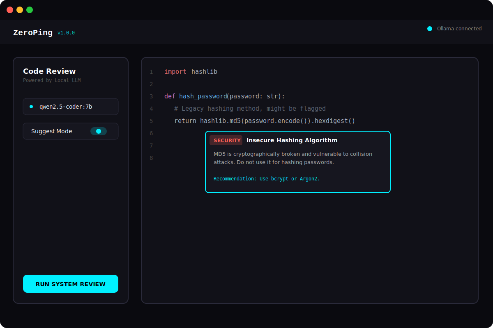

# ZeroPing

ZeroPing is an open-source, fully offline code review tool that connects straight to your local Ollama setup. Your codebase stays right where it belongs: on your machine.


<div align="center">
  
</div>

## Why build this?

Using cloud-based AI tools to review code means you're uploading your logic, keys, and private architectures to a remote server. For a lot of teams and security-conscious folks, that's a hard no. 

ZeroPing acts as a lightweight interface that lets you run real AI code reviews locally with models like Qwen or Llama. Everything runs completely offline once the models are downloaded.

## How it works

The architecture is split into three parts:
- **UI:** A standard Next.js frontend to paste code and visualize issues.
- **API:** A small Python FastAPI backend that strictly types requests and parses LLM outputs.
- **Engine:** Your local Ollama instance doing the heavy lifting.

## Setup Instructions

Make sure you have Node, Python, and Ollama installed before starting.

### 1. Grab a model
We recommend starting with Qwen, as it handles structured formatting decently well.
```bash
ollama pull qwen2.5-coder:7b
```

### 2. Run the API (Backend)
Clone the repo and spin up the Python backend so it can talk to Ollama on port 8000.
```bash
git clone https://github.com/thedixitjain/zeroping.git
cd zeroping/backend

python -m venv venv

# If on Windows:
.\venv\Scripts\activate
# If on Mac/Linux:
# source venv/bin/activate

pip install -r requirements.txt
uvicorn main:app --port 8000
```

### 3. Run the UI (Frontend)
Open up a new terminal window at the root of the project to start Next.js.
```bash
cd zeroping
npm install
npm run dev
```

You can now open `http://localhost:3000` to start reviewing code locally.

## Contributing

Pull requests are totally welcome. Feel free to open an issue if you encounter bugs or want to suggest improvements to the prompt logic or UI components.

## License

MIT License. See the `LICENSE` file for details.
